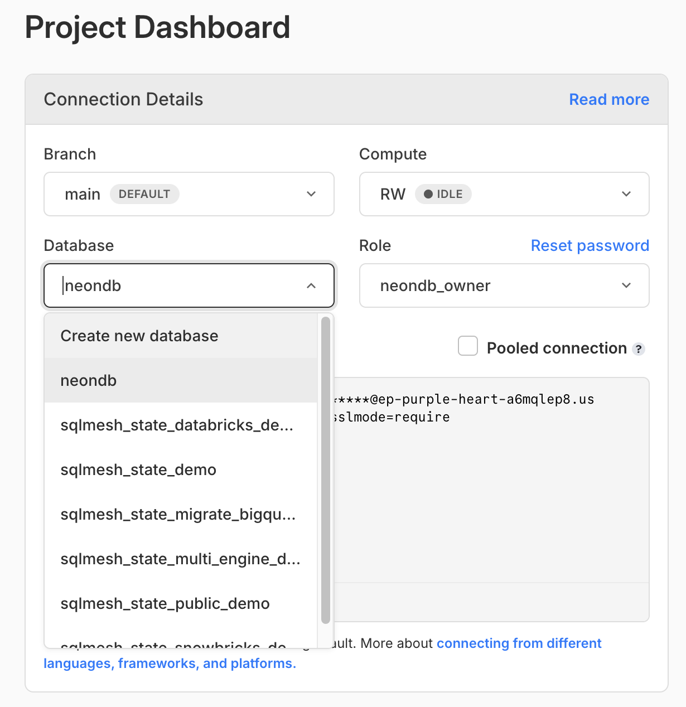
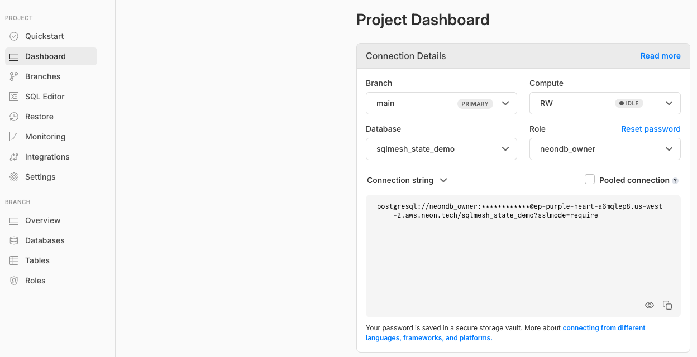

# dbt Snowflake -> SQLMesh Databricks

Migrations are hard. I know it very deeply. I've had my fair share of data warehouse migrations during my consulting days. What's really wonderful is that we believe they shouldn't be so miserable. 

This is a demo project to show you how easy it is to migrate to SQLMesh AND a new data platform in 5 minutes (literally). This is not meant to be exhaustive. This is a starting point to show you what's possible. And that hopefully for all of us, migrations don't have to be so miserable anymore. 


## Setup

```bash
# create a virtual environment
python -m venv venv
source venv/bin/activate
pip install -r requirements.txt
source venv/bin/activate
```

Update your `dbt_project.yml` for a SQLMesh project start date

```yaml
models:
  +start: Jan 1 2000
```

Update your `profiles.yml` for the relevant credentials. Feel free to reuse the environment variable defaults or your own conventions.

**Setup your sqlmesh state backend for a realistic SQLMesh setup:**

1. Sign up for a free Neon account: [here](https://neon.tech/)
2. Create a new database named: `sqlmesh_state_snowbricks_demo`

3. Export your environment variables based on the newly created database connection string


```bash
# examples based on the image above
export SQLMESH_STATE_HOST=ep-purple-heart-a6mqlep8.us-west-2.aws.neon.tech
export SQLMESH_STATE_USERNAME=<your-neon-username>
export SQLMESH_STATE_PASSWORD=<your-password-blurred-in-the-image>
```

## Quickstart

```bash
# run and test your dbt snowflake project first
dbt build
```

```bash
# now transform it into a sqlmesh databricks project in one, single command
sqlmesh plan
```

```bash
# if you're skeptical, run data tests (audits) on your new sqlmesh project
sqlmesh audit
```

```bash
# if you want to automate sqlmesh, run this command on a cron job in github actions/orchestrator
sqlmesh run
```

```bash
# if you want to start developing right away, we'll create dev environments for free and very fast
sqlmesh plan dev_migrate --include-unmodified
```


TODO Instructions:

- add link to official docs for this quickstart
- you get column level lineage for free, no paywalls 