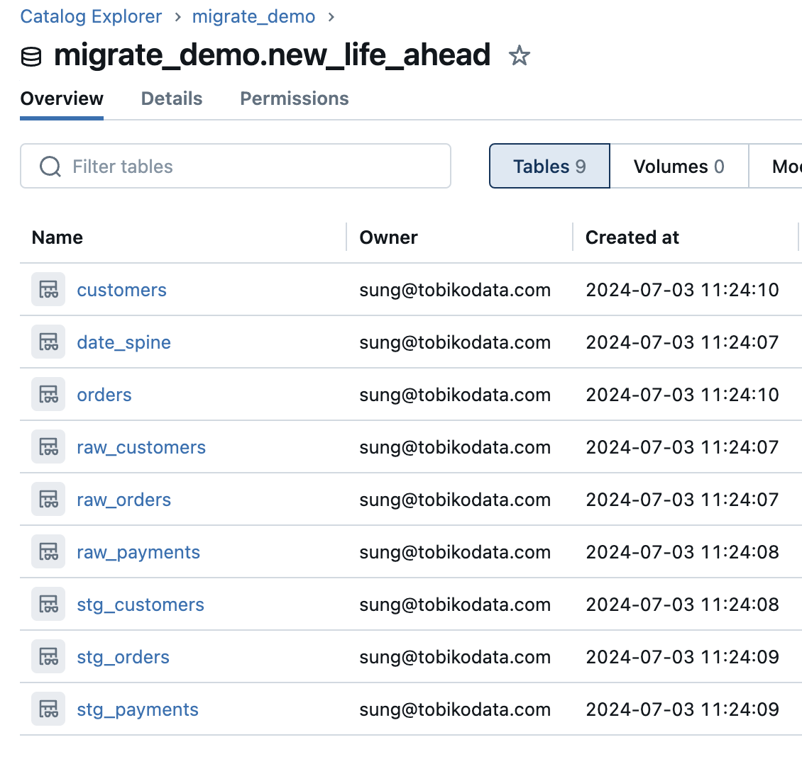
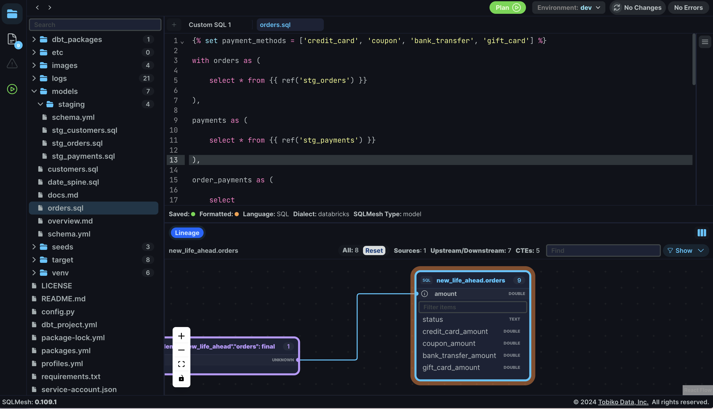

# dbt Snowflake -> SQLMesh Databricks

Migrations are hard. I know it very deeply. I've had my fair share of data warehouse migrations during my consulting days. What's really wonderful is that our team at Tobiko believes they shouldn't be so miserable. 

This is a demo project to show you how easy it is to migrate to SQLMesh AND Databricks in 5 minutes (literally, including your jinja macros). This is not meant to be exhaustive. This is a starting point to show you what's possible. And that hopefully for all of us, migrations don't have to be so miserable anymore. 

<div>
    <a href="https://www.loom.com/share/62971220f6e14ccf844a5395e236dfaa">
      <p>dbt Snowflake to SQLMesh Databricks Demo - Watch Video</p>
    </a>
    <a href="https://www.loom.com/share/62971220f6e14ccf844a5395e236dfaa">
      
    </a>
  </div>

Snowflake (Left) -> Databricks (Right)

<p float="left">
  
  
</p>

[LEARN MORE in our official docs for other dbt projects you want to migrate.](https://sqlmesh.readthedocs.io/en/stable/integrations/dbt/)

## Setup

```bash
# create a virtual environment
python -m venv venv
source venv/bin/activate
pip install -r requirements.txt
source venv/bin/activate
```

Note: Assumed you have access to Snowflake and Databricks accounts to run this demo.

Update your `profiles.yml` for the relevant credentials. Feel free to reuse the environment variable defaults or your own configs as a starting point.

```bash
# for snowflake
export SNOWFLAKE_USER=<your-snowflake-user-name>
export SNOWFLAKE_PASSWORD=<your-snowflake-password>

# for databricks
export DATABRICKS_ACCESS_TOKEN=<your-databricks-access-token>
export DATABRICKS_SERVER_HOSTNAME=<your-databricks-server-hostname>
export DATABRICKS_HTTP_PATH=<your-databricks-http-path>
```

## Quickstart

```bash
# run and test your dbt snowflake project first
dbt build
```

```bash
# now transform it into a sqlmesh databricks project in one, single command
sqlmesh plan
```

```bash
# if you're skeptical, run data tests (audits) on your new sqlmesh project
sqlmesh audit
```

```bash
# if you want to automate sqlmesh, run this command on a cron job in github actions/orchestrator
sqlmesh run
```

```bash
# if you want to start developing right away, we'll create dev environments for free and very fast
sqlmesh plan dev --include-unmodified
```

```bash
# see column level lineage for free, no paywalls, example experience below
# note: make sure to close this ui terminal process when applying sqlmesh CLI commands directly
sqlmesh ui

# open this link in your browser: http://127.0.0.1:8000
```


Have a wonderful new life ahead of you. 